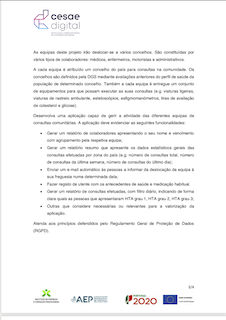
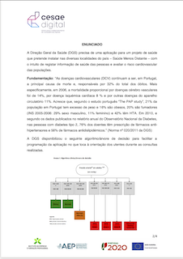
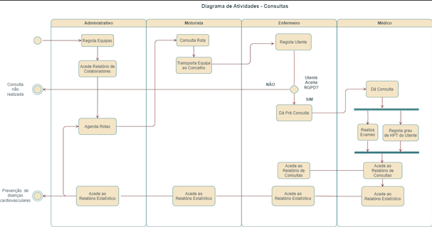

# Saúde Menos Distante

## Este é um programa escrito em C# que gera a atividade diária de uma carrinha de Rastreios de Saúde.

O programa faz parte do projeto de avaliação das unidades de Eng. de Software e POO do Curso de Software Developer Promovido pelo CESAE Digital.

  

  

O programa foi desenvolvido para Consola/ Terminal, sem interface gráfico, nem bases de dados associadas.

Lida com eventos imediatos, como a ***inserção de Utentes***, ***Colaboradores*** e ***consultas de Rastreio***.  
Mas também permite fazer consultas de Dados provenientes de listas previamente elaboradas para ***visualização de Rotas de Destino***, 
***Impressão de Relatórios estatísticos***.

